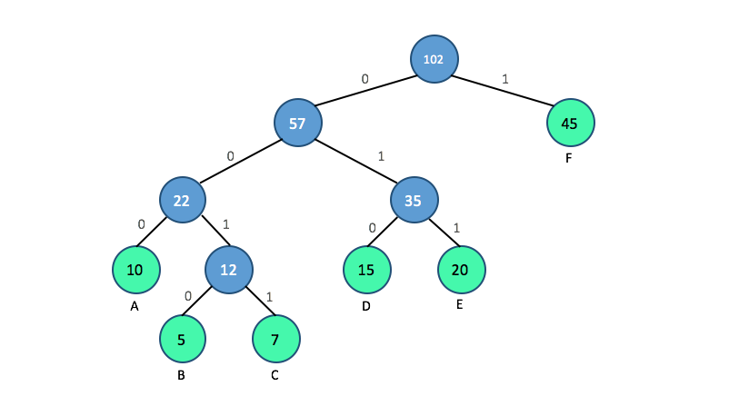

# Huffman Coding
## Project Description
In this project, we will demonstrate how to compress and decompress a text file using Huffman coding. The project is divided into three main parts:

 1.  **Constructing Huffman code** ( [HuffmanCode.ipynb](https://github.com/ybruce61414/Data-Structures/blob/master/Tree/HuffmanCoding/HuffmanCode.ipynb)):
     * Building a **Huffman tree** from input characters, and generating **Huffman codes** by traversing the Huffman tree. 
 2.  **Encoding the file** ([main_encode.ipynb](https://github.com/ybruce61414/Data-Structures/blob/master/Tree/HuffmanCoding/main_encode.ipynb)):
      * Encoding the text into Huffman string(binary sequence), and save it as binary file in [ASCII](https://www.eso.org/~ndelmott/ascii.html) hex format. 
  
 3.  **Decoding the file** ([main_decode.ipynb](https://github.com/ybruce61414/Data-Structures/blob/master/Tree/HuffmanCoding/main_decode.ipynb)):
     * Decoding the binary file using decimal to binary converter, and convert it into text data via the Huffman code.  
         

## What is Huffman coding?
Huffman coding is a lossless data compression algorithm. The idea is to assign variable-length codes to input characters, instead of fixed-length codes. Lengths of the assigned codes are based on the frequencies of corresponding characters. The most frequent character gets the smallest code, whereas the least frequent character gets the largest code.

Normally, each character in a text file is stored in eight bits using an encoding called ASCII. A Huffman-encoded file breaks down the rigid 8-bit structure so that the most commonly used characters are stored in just a few bits ('a' could be "10" or "1000" rather than the ASCII, which is "01100001").  However, the least common characters will take up more than 8 bits ('z' might be "00100011010") in some rare situations. Huffman encoding, on the whole, creates a much smaller file than the original one.

 ## How to generate Huffman code ?
 There are mainly two major parts in generating Huffman code:
 
1.  Build a Huffman tree from input characters.
2.  Traverse the Huffman tree and assign codes to characters.
 
 
 **Step for building a Huffman tree**
 
 - Count the frequency of each character.  
   ```python
   {'A':10, 'B':5, 'C':7, 'D':15, 'E':20, 'F':45}
   ``` 
 -  Extract two nodes with the minimum frequencies.
 -  Create a **parent node** with a frequency that is the sum of the two extracted nodes' frequencies, and make the first extracted node as it's **left child** and the other as it's **right child**.
 - Do the above two steps successively until there is only one node which all others spring from, and which is the root of the tree.
 - The Huffman tree is complete.
 
 **Step for assigning codes from Huffman Tree**
 
 - Traverse the tree to reach each leaf node(character) from the root.
 - Append a **0** for each time you take the **left branch**, and a **1** for each time you take the **right branch**. Print the code word when a leaf node is encountered.
 - The Huffman code is obtained.
    ```python
   {'A':'000', 'B':'0010', 'C':'0011', 'D':'010', 'E':'011', 'F':'1'}
   ``` 
   
 ## Brief look at Constructing Huffman code
 In this section, we briefly introduce our method to produce the Huffman tree with the code fragment. Firstly, we let the basic element be the class `Huffman_node()` to store the **input characters** and its corresponding **frequencies**, and define the `repr()` method to print out the status of the nodes. 
 
 ```python
 class Huffman_node():
    def __init__(self,cha,freq):
        self.cha = cha
        self.freq = freq
        self.Lchild = None
        self.Rchild = None
   
    def __repr__(self):
            return '(node object %s:%d)' % (self.cha,self.freq)
 ``` 
 Secondly, we create the class `HuffmanCoding()`. Here are the main source code( [HuffmanCode.ipynb](https://github.com/ybruce61414/Data-Structures/blob/master/Tree/HuffmanCoding/HuffmanCode.ipynb)) snippet involving generating Huffman tree and Huffman code below.
 
 We define the class that has 6 attributes: `self.root` stores the **root node** of the Huffman tree; `self.text` stores the **input text** in string;  `self.nodedic` stores **frequency-node pair** in dictionary; `self.huffcodes` stores **character-codeword pair**, which is the **Huffman code**, in dictionary; `self.encodes` stores the **encoded binary string** in list, and `self.decodes` stores the **decoded text string** in list.
 ```python 
 class HuffmanCoding():
    def __init__(self,text):
        self.root = None
        self.text = text
        self.nodedic = {}
        self.huffcodes = {}
        self.encodes = []
        self.decodes = []
                
    #-------------- generating huffman tree -------------   
    def generate_tree(self):
        self.generate_node() 
        while len(self.nodedic) != 1:
            min_node1 = self.find_minNode()
            min_node2 = self.find_minNode()
            self.root = self.merge_nodes(min_node1,min_node2)
        return self.root              
        
    #---- function set for generating huffman tree -----
    def character_freq(self):
        pass
    def generate_node(self):
        pass
    def find_minNode(self):
        pass    
    def merge_nodes(self,min1,min2):
        pass    
    #--------------generating huffman code--------------
    def generate_huffcode(self):
        code = ''
        if self.root != None:
            return self.rec_generate_huffcode(self.root,code)         
            
    def rec_generate_huffcode(self,cur_node,codestr):
        if not cur_node.Lchild and not cur_node.Rchild:
            self.huffcodes[cur_node.cha] = codestr  
        if cur_node.Lchild:
            self.rec_generate_huffcode(cur_node.Lchild,codestr + '0')
        if cur_node.Rchild:
            self.rec_generate_huffcode(cur_node.Rchild,codestr + '1')        
  ```        
 
 ## Usage 
 - Save the code we mentioned above in the same directory.  
 [HuffmanCode.ipynb](https://github.com/ybruce61414/Data-Structures/blob/master/Tree/HuffmanCoding/HuffmanCode.ipynb)/ [main_encode.ipynb](https://github.com/ybruce61414/Data-Structures/blob/master/Tree/HuffmanCoding/main_encode.ipynb)/ [main_decode.ipynb](https://github.com/ybruce61414/Data-Structures/blob/master/Tree/HuffmanCoding/main_decode.ipynb)
 
 - Create a sample text file for compression, or download a sample file from [sample.txt](https://github.com/ybruce61414/Data-Structures/blob/master/Tree/HuffmanCoding/sample%20/sample.txt).
 
 - ### Execute the programs
   ---  
   - **main_encode(file_path):**  
   *Input:*  [sample.txt](https://github.com/ybruce61414/Data-Structures/blob/master/Tree/HuffmanCoding/sample%20/sample.txt)  
   *Output:*  [encode_sample.bin](https://github.com/ybruce61414/Data-Structures/blob/master/Tree/HuffmanCoding/sample%20/encode_sample.bin) **/** [encode_sample_huff.txt](https://github.com/ybruce61414/Data-Structures/blob/master/Tree/HuffmanCoding/sample%20/encode_sample_huff.txt) **/** Zero Paddings: 1 **/** Compression Ratio: 42.76%    
   
   - **main_decode(bin_path,huff_path,padding):**  
   *Input:*  [encode_sample.bin](https://github.com/ybruce61414/Data-Structures/blob/master/Tree/HuffmanCoding/sample%20/encode_sample.bin) **/** [encode_sample_huff.txt](https://github.com/ybruce61414/Data-Structures/blob/master/Tree/HuffmanCoding/sample%20/encode_sample_huff.txt) **/** padding: 1  
   *Output:*  Text data same as sample.txt (check it from [main_decode.ipynb](https://github.com/ybruce61414/Data-Structures/blob/master/Tree/HuffmanCoding/main_decode.ipynb))
    ---    
   The encoded file(encode_sample.bin) is stored as bytes (8 bits or 8 binary digits). Because the Huffman coding algorithm doesn't use the 8-bit format, the encoded file won't often have lengths that are multiples of 8. The remaining digits will be filled in with 0s. In this case, one 0s would be added at the end of the file.
   
 ## Result
 
 File           | Size  
--------------|------------------------
Initial file    | 2.1972656	KB
Compressed file  | 1.2578125	KB

**Compression Ratio:** 42.76%
 
 
 

 
 
 
 
